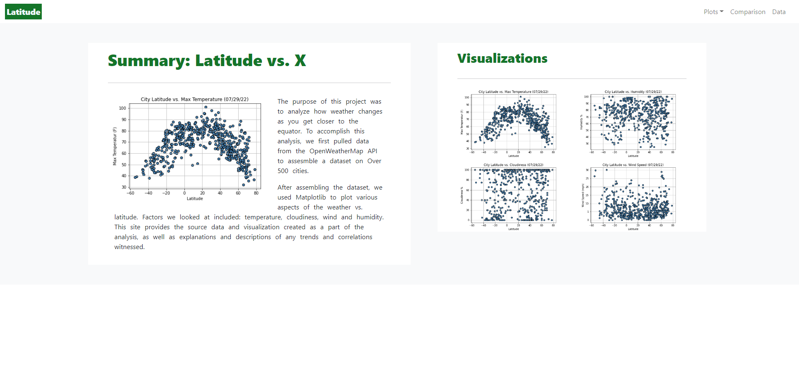

# Weather Data Web Design

## Background

Data is more powerful when we share it with others! We used HTML and CSS to create a dashboard featuring the analysis that we've done for weather-data

## Tools
* Javascript
* Bootstrap
* HTML/CSS
* Python 
* Pandas

## Instructions

1. This Git repository, contains HTML files along with three folders; `assets`, `Resources` and `visualizations`. 

  * `index.html` file in the main folder, will be the landing page that a user first encounters when viewing the page.

  * The `Resources` folder contains the CSV file with the [weather data](Resources/cities.csv) used for this website along with the [python code](Resources/app.py) to convert csv to [html](Resources/cities.html). The `visualizations` folder contains the HTML pages that display the [visualizations](visulaization) and the [images](visualization) used for visulaization.

2. Web site is deploy to ["GitHub" Pages](https://singhsanoo.github.io/weather-data-web-design/). 

